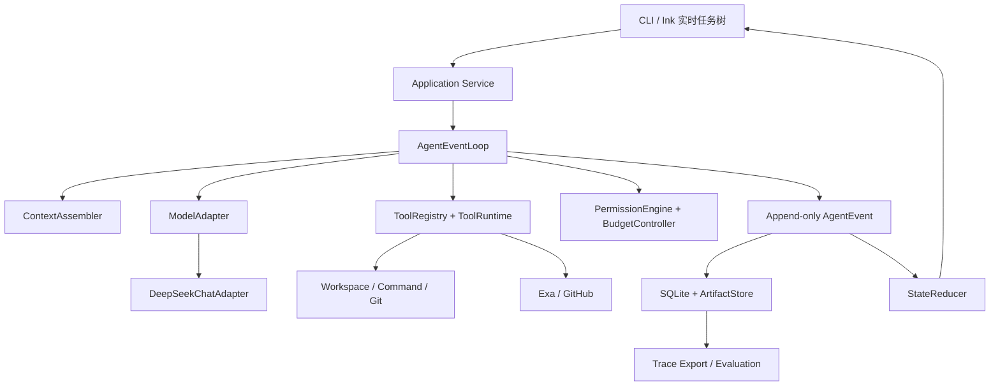

# CodeFlow Agent 总体架构

具体组件的需求、前后依赖、公开契约、错误恢复和验收标准见[组件需求设计索引](components/README.md)。

## 组件图



## 十个核心组件

| 组件 | 责任 | 不负责 |
| --- | --- | --- |
| CLI/TUI | 命令解析、实时状态、审批、取消、恢复入口 | 决定 Coding 策略 |
| Application Service | 组装依赖、管理用例和生命周期 | 供应商协议细节 |
| AgentEventLoop | 驱动模型—工具—观察循环和重规划 | 写死 Bug/功能流程 |
| ContextAssembler | 指令优先级、按需代码、检查点和上下文预算 | 长期记忆/RAG |
| ModelAdapter | 隔离模型协议、tool calls、用量和取消；当前先走非流式闭环 | 直接执行工具 |
| ToolRegistry/Runtime | 工具定义、参数校验、执行和统一结果 | 绕过权限执行 |
| Permission/Budget | 风险判断、批准绑定、调用/时间/费用限制 | 修改事件事实 |
| Event/State | 保存不可变事实并投影任务树 | 存储原始秘密 |
| Storage/Trace | SQLite、artifact、保留、脱敏导出 | 云同步与遥测 |
| Evaluation | fixture、隐藏验证器、回归和 OpenCode 对照 | 用 Judge 覆盖硬规则 |

## 依赖方向

```text
CLI -> Application -> Agent core
                     |-> Context contracts
                     |-> ModelAdapter <- DeepSeek provider
                     |-> Tool contracts <- local/external providers
                     |-> Policy
                     |-> EventStore <- SQLite provider
                     `-> Trace/Evaluation
```

核心层只依赖内部接口。外部 SDK、数据库和命令执行实现位于边界层，避免供应商类型向 Agent 循环扩散。

## 生命周期

```text
CREATED -> RUNNING -> WAITING_USER / WAITING_APPROVAL / VERIFYING
        -> COMPLETION_CLAIMED -> COMPLETION_VERIFIED
        -> CANCELLING -> CANCELLED
        -> FAILED / UNKNOWN
```

`UNKNOWN` 专门表示 commit、push、PR 等外部写操作的真实状态不确定；恢复必须先对账，不能盲目重试。

## 结构化审计上下文

每条 `AgentEvent` 除事件专属 `payload` 外，还必须携带受 schema 约束的 `context`：

- 工作区、代码版本和配置版本；
- 模型/工具/控制操作的名称、状态和耗时；
- token、缓存与费用用量；
- 风险级别、任务授权和单次批准引用；
- 错误类别、可重试性与恢复建议；
- 副作用状态，包括外部结果未知的 `unknown`。

这些字段用于任务树、成本归因、安全审计和恢复判断，不能依赖各事件自行约定 `payload` 键名。事件特有结果仍可放入 `payload`，长输出由 `ToolRuntime` 转为 `ArtifactReference`。

## 未来扩展缝

- `ModelAdapter`：增加模型供应商。
- `ToolProvider`：未来接 MCP，但 MVP 只有审核过的固定工具。
- `actorId`、`parentTaskId`：未来多 Agent 兼容字段，不启用编排。
- `MemoryProvider`：未来长期记忆接口，不从 Session trace 自动生成。
- `SearchProvider`：MVP 默认 Exa，可替换而不改变核心循环。

扩展缝只是稳定边界，不提前建设未验证功能。
