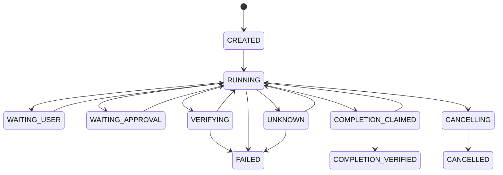

# C01 事件事实层与 StateReducer

- 状态：已实现，D1–D3 事件事实、增量归约、批量重放和 trace 完整性门禁已交付
- 代码位置：`src/events/agent-event.ts`、`src/events/event-store.ts`、`src/events/state-reducer.ts`
- 测试位置：`tests/agent-event.test.ts`、`tests/event-store.test.ts`、`tests/state-reducer.test.ts`、`tests/state-reducer-contract.test.ts`
- 硬依赖：[C00 共享契约](00-shared-contracts.md)
- 参考 ADR：[ADR-0001](../decisions/0001-modular-monolith.md)、[ADR-0002](../decisions/0002-coverage-review-corrections.md)
- 下游消费者：C02、C10、C11、C13、C14、C15

## 1. 目标与边界

C01 把 Agent 实际发生的模型、工具、审批、验证和生命周期变化记录为追加式 `AgentEvent` 事实，并通过无 I/O reducer 派生用户可见状态。事实不可被摘要或 UI 反向覆盖；原始 reasoning、凭证和超长结果不进入事件。

C01 不执行模型或工具、不决定权限/预算、不实现 SQLite 或 ArtifactStore。持久化由 C02 提供，实时 UI 由 C13 消费本组件的投影。

## 2. 事件信封与目录

每条事件包含：`schemaVersion`、event/session/task/actor/parent-task/trace/span 标识、UTC `occurredAt`、Session 单调 `sequence`、稳定 `type`、结构化 `context` 和 JSON `payload`。`context` 固定承载工作区/代码/配置版本、操作状态与 `operationHash`、用量、授权、错误、副作用状态和预算快照；长结果使用 `ArtifactReference`。

首版事件目录：

- 会话：`session.created`、`session.started`、`session.cancelling`、`session.cancelled`、`session.failed`
- 计划与交互：`plan.updated`、`user.input.requested`、`user.input.received`
- 执行事实：`model.started`、`model.completed`、`tool.started`、`tool.completed`、`tool.failed`
- 审批与验证：`approval.requested`、`approval.resolved`、`verification.started`、`verification.completed`
- 完成门：`completion.claimed`、`completion.verified`、`completion.rejected`
- 外部状态与预算：`operation.unknown`、`operation.reconciled`、`budget.updated`

解析使用 `parseVersionedSchema`：未知主版本返回结构化 `unsupported_schema_version`；同一版本中的未知可选字段被忽略，保留已有事实语义。

## 3. 公开契约

```ts
interface EventWriter {
  append(event: AgentEvent): Promise<"inserted" | "duplicate">;
}

interface EventReader {
  list(sessionId: StableId, afterSequence?: number): Promise<readonly AgentEvent[]>;
  latestSequence(sessionId: StableId): Promise<number | null>;
}

interface EventSubscriber {
  subscribe(sessionId: StableId, listener: (event: AgentEvent) => void | Promise<void>): () => void;
}

interface EventStore extends EventWriter, EventReader {}

class StateReducer {
  apply(event: AgentEvent): SessionView;
  snapshot(): SessionView | null;
}

function reduceAgentEvents(events: readonly AgentEvent[]): SessionView | null;
function checkTraceIntegrity(events: readonly unknown[]): TraceIntegrityReport;
```

`InMemoryEventStore` 是 C01 的可替换事实存储和流式订阅替身。它允许缺口被记录，以便完整性检查明确报出缺失事实；相同 event ID 且内容相同返回 `duplicate`，内容不同或序号不递增返回 `EventStoreError`，不会覆盖已有事实。读取和订阅返回副本，监听器失败不影响事实追加。

所有 provider 在读取和订阅边界统一校验 Session UUID、增量游标和 listener；无效输入返回稳定的 `EventStoreError` 分类，不能因内存或 SQLite provider 不同而泄漏 Zod/SQLite 错误。

所有持久化 EventStore 实现必须遵循同一 append 语义：sequence 需要相对已存最后一条严格递增，但允许缺口；相同 Session+sequence 不能被另一事件占用。C02 不得在 SQLite provider 中私自收紧为 `last + 1`。订阅与分页的无竞态扩展需先升级本契约，不能只成为某个 provider 的私有语义。

## 4. 生命周期与投影



`SessionView` 至少包含当前状态、目标、计划及 revision/变更原因、活动操作、最近错误及 category、验证结果、预算摘要、待审批事项、最后 sequence 和 `traceComplete`。计划 revision 必须严格递增且携带非空变更原因；完成声明不能绕过 `completion.claimed` 或活动操作检查；验证失败进入 `FAILED`。

C04 完成后，`budget.updated` 必须携带 `context.budgetSnapshot`，其 schema 直接复用 C04 版本化 `BudgetSnapshot`，覆盖 token、retry、no-progress、reservation 和 `costUsd: null`；reducer 只把该字段投影到 `SessionView.budget`。旧四维 `context.budget` 仅为同一 AgentEvent v1 的历史可选字段保留解析兼容，不再更新可见预算，也不能用于新 `budget.updated` 事实。

模型/工具 started 与 completed/failed/cancelled 通过 `operationHash` 配对；未提供 hash 时回退到 span ID。`operation.unknown` 必须同时提供操作名称、外部身份和恢复建议，并进入 `UNKNOWN`；`operation.reconciled` 只有 `applied`/`not_applied` 才能回到 `RUNNING`，仍为 `unknown` 时继续阻断完成。

## 5. 完整性、错误与恢复

`StateReducer` 增量应用要求第一个事实是 sequence 0 的 `session.created`，之后每次只能应用下一个序号且只能属于同一 Session。`reduceAgentEvents` 先调用 `checkTraceIntegrity`，因此乱序、重复 ID、跨 Session、未知主版本、缺口和非法状态转换都会拒绝投影而不修改事实。

`TraceIntegrityReport` 返回 `complete`、事件数量、Session、首个缺口、首个非法序号和第一个结构化错误。缺口以首个缺失 sequence 报告，崩溃恢复使用 EventStore 的 `latestSequence` 继续分配，不以数组长度推断。

## 6. 验收证据

- `EVENT-AC-001`：`tests/state-reducer.test.ts` 与 `tests/state-reducer-contract.test.ts` 覆盖合法生命周期、非法转换、计划、审批、验证和完成门。
- `EVENT-AC-002`：`state-reducer-contract.test.ts` 重放 10,000 条 `budget.updated`，比较批量和增量快照。
- `EVENT-AC-003`：`event-store.test.ts` 覆盖重复/冲突/乱序/缺口；`state-reducer-contract.test.ts` 覆盖缺口、schema、跨 Session 和恢复归约。
- `EVENT-AC-004`：契约测试覆盖模型/工具配对、审批请求/解决、验证 started/completed、完成 claim/verify/reject 及 UNKNOWN 显式恢复。
- `EVENT-AC-005`：`checkTraceIntegrity` 契约断言首个缺失序号和结构化错误。

本组件已通过 `pnpm typecheck`、`pnpm test`；交付前仍需执行仓库统一门禁 `pnpm check` 和 `pnpm start -- --help`。SQLite EventStore、ArtifactStore 和 UI 视图仍按 C02/C13 计划实现，不在 C01 中用空实现提前标记完成。
