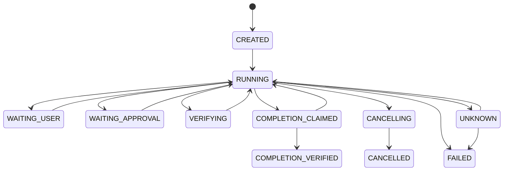

# C01 事件事实层与 StateReducer

- 状态：结构化 schema 与基础 reducer 已实现，事件目录和恢复语义待补
- 目标阶段：D1–D3
- 代码位置：`src/events/agent-event.ts`、`event-store.ts`、`state-reducer.ts`
- 硬依赖：[C00 共享契约](00-shared-contracts.md)
- 下游消费者：C02、C10、C11、C13、C14、C15

## 1. 目标

用追加式事实事件记录 Agent 实际发生的模型、工具、审批、验证和生命周期变化，并通过纯函数 reducer 派生用户可见状态。事件是审计与恢复依据，UI 文本和摘要不能反向覆盖事实。

## 2. 职责边界

### 必须负责

- `AgentEvent` schema、事件类型目录和版本。
- Session 内严格递增序号与幂等追加约束。
- 生命周期、计划、活动操作、错误和验证状态的确定性投影。
- 为恢复、Trace、CLI 和 Evaluation 提供相同事实源。

### 明确不负责

- 执行模型或工具。
- 决定权限、预算或任务是否真正完成。
- 把原始 reasoning、凭证或无限长输出存进事件。

## 3. 前置依赖与解锁条件

| 依赖 | 需要稳定的能力 | 未满足时禁止 |
| --- | --- | --- |
| C00 | StableId、CodeSnapshot、StructuredError、schema version | 新增持久化事件 |

事件 schema 首版稳定后才能实现 C02 SQLite EventStore；状态机稳定后才能实现 C13 实时 UI。

## 4. 事件信封

每条事件必须包含：

- 身份：event/session/task/actor/parent task/trace/span ID。
- 顺序：schema 版本、UTC 时间、Session 单调序号。
- 类型：稳定的 `eventType`。
- context：工作区、代码/配置版本、操作状态、耗时、用量、授权、错误、副作用状态。
- payload：只存事件特有且可序列化的内容；长结果改存 `ArtifactReference`。

## 5. 生命周期状态机

`verification.completed(passed)` 只表示一项验证产生证据，状态回到 `RUNNING`；只有 `completion.claimed` 经 C10 放行后，才能产生 `completion.verified`。

## 6. 功能需求

- `EVENT-FR-001`：同一 Session 的 sequence 必须严格递增，重复 event ID 只能幂等返回，不能再次应用。
- `EVENT-FR-002`：reducer 必须是无 I/O 纯函数，相同事件序列产生相同状态。
- `EVENT-FR-003`：跨 Session 事件混合、未知破坏性 schema 和非法状态转换必须拒绝。
- `EVENT-FR-004`：`UNKNOWN` 必须携带 operation name、外部身份和恢复建议。
- `EVENT-FR-005`：计划更新保留 plan revision 和变更原因，不覆盖历史事件。
- `EVENT-FR-006`：工具 started/finished 通过 operation hash 或 span ID 成对关联。
- `EVENT-FR-007`：状态投影至少输出当前状态、计划、活动操作、最近错误、验证状态、预算摘要和待审批事项。

## 7. 并发与顺序

- MVP 由单写者为每个 Session 分配 sequence。
- 并行只读工具可以拥有不同 span，但完成事件仍由单写者串行落库。
- UI 可以消费流式事件，但最终显示必须以持久化事件重放结果为准。
- 崩溃后 sequence 从数据库最大值继续，不得根据数组长度推断。

## 8. 错误与恢复

| 情况 | 行为 |
| --- | --- |
| 重复 event ID | 幂等忽略并返回已有事件 |
| 相同 sequence 不同事件 | 数据完整性错误，停止 Session |
| 缺失中间 sequence | 标记 trace 不完整，禁止完成 |
| 未知事件次版本 | 保留事件并忽略新增可选字段 |
| 未知事件主版本 | 停止恢复并要求迁移 |
| reducer 异常 | 不修改事实事件，报告投影失败 |

## 9. 安全与隐私

- `EVENT-SR-001`：事件不得包含 API Key、环境变量全集和原始 reasoning。
- `EVENT-SR-002`：路径和参数摘要必须经过敏感字段处理。
- `EVENT-SR-003`：安全否决、审批、取消和外部写事件不得被采样丢弃。

## 10. 验收标准

- `EVENT-AC-001`：覆盖全部合法状态转移和非法转移的表驱动测试。
- `EVENT-AC-002`：一万条事件重放得到与增量 reducer 相同状态。
- `EVENT-AC-003`：重复、乱序、缺口和崩溃恢复故障注入产生预期结果。
- `EVENT-AC-004`：每个模型、工具、审批、验证和完成路径都有可关联的 started/finished 或显式中断事件。
- `EVENT-AC-005`：关键 trace 完整性检查可确定指出缺失的首个事件。

## 11. 实现任务建议

1. 把事件类型与 payload schema 从单一 enum 拆成判别联合。
2. 增加状态转换守卫、plan revision 和 budget projection。
3. 定义 EventWriter 与 EventSubscriber 接口。
4. 建立重放、非法转换、并行 span 和完整性测试。
5. 交付给 C02 实现持久化，交付给 C13 实现视图 reducer。
