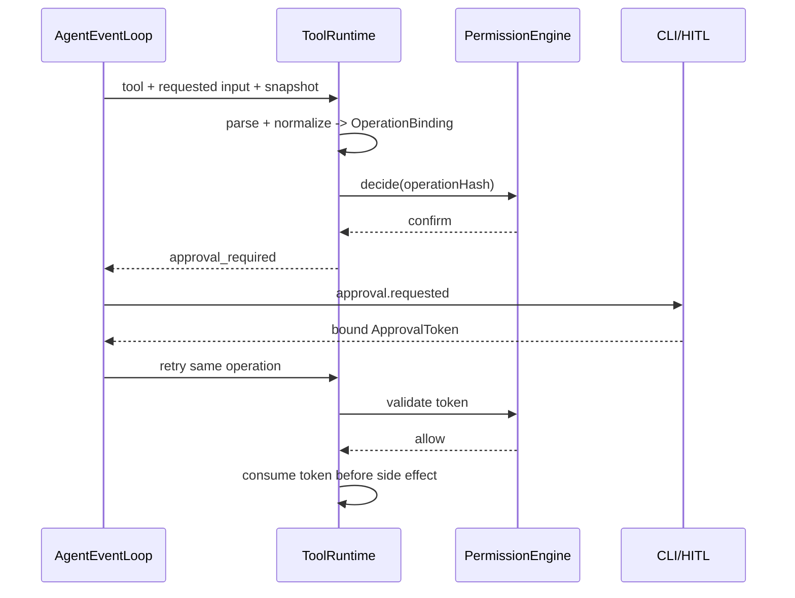

# C03 PermissionEngine 与批准契约

- 状态：风险判断、operation hash 和未知风险默认拒绝已实现；一次性消费仍由 C08 进程内完成，持久化批准缺失
- 目标阶段：D1–D6
- 代码位置：`src/policy/permission-engine.ts`、`operation-hash.ts`
- 硬依赖：[C00 共享契约](00-shared-contracts.md)
- 下游消费者：C08、C09、C11、C13、C14

## 1. 目标

在任何工具产生副作用前给出确定的 allow/confirm/deny 决策，并使高风险批准严格绑定最终工具、参数和代码版本，不能被模型文本、仓库内容或旧批准扩大。

## 2. 职责边界

### 必须负责

- 四级风险分类的统一决策。
- 任务级写授权和单操作批准的验证。
- operation hash 规范化、期限检查和一次性消费语义。
- 为 UI 生成不含秘密的批准摘要。
- 提供审计所需的 authorization/approval 引用。

### 明确不负责

- 展示交互 UI、执行工具、保存审批或查询外部操作状态。
- 根据 LLM 自评降低风险等级。

## 3. 权限矩阵

| 风险 | 默认行为 | 示例 | 授权作用域 |
| --- | --- | --- | --- |
| `automatic` | allow | 读取、搜索、Git 状态 | 固定工具策略 |
| `task_authorized` | 任务已授权才 allow | patch、write、command | Session/Task + workspace |
| `single_confirmation` | 每次 confirm | 删除、安装、发布 | 最终 operation hash + expiry |
| `control` | allow，但有状态守卫 | ask/update plan/finish | 当前 Session 生命周期 |

风险等级由注册的工具定义决定，模型不能在调用参数里覆盖。

## 4. 批准令牌

```ts
interface OperationBinding {
  bindingVersion: number;
  sessionId: StableId;
  taskId: StableId;
  authorizationVersion: string;
  toolName: string;
  toolVersion: string;
  inputSchemaHash: string;
  normalizationVersion: string;
  effectiveInputHash: string;
  workspaceId: StableId;
  codeVersion: string | null;
  diffHash: string | null;
  configVersion: string;
}

interface ApprovalToken {
  approvalId: StableId;
  operationHash: string;
  expiresAt: UtcTimestamp;
}

operationHash = sha256(canonicalJson(operationBinding))
```

`effectiveInputHash` 来自 C07 `inputSchema` 解析并执行版本化 normalization 后的最终参数，不是模型发送的原始 JSON。Session/Task/授权版本、工具版本、schema、normalization、workspace、代码/diff 和行为配置任一变化都使旧批准失效。只影响显示、不影响行为的 UI 配置不得进入 binding。

当前可编译 `ApprovalToken` 仍含 toolName 且 hash 只覆盖 tool/input/codeVersion；上面的 `OperationBinding` 和精简 token 是目标契约。迁移必须先更新 operation-hash 契约测试，再审计 C07/C08/C09/C13。

Runtime 在工具开始执行前消费 token。消费后即使工具失败也不得自动复用；外部写失败进入 `UNKNOWN` 并先对账。

PermissionEngine 必须注入 C00 `Clock`，不得直接读取 `Date.now()`。`Date.parse(expiresAt) <= Date.parse(clock.utcNow())` 视为已经过期，解析失败为 deny，过期为重新请求批准；测试使用虚拟时钟覆盖等于边界和时钟前后跳变。

## 5. 功能需求

- `PERM-FR-001`：策略只接受 Registry 中已审核的风险与副作用元数据。
- `PERM-FR-002`：operation hash 使用 Zod 解析后的最终参数，而不是模型原始 JSON 文本。
- `PERM-FR-003`：批准摘要展示 tool、remote/path、branch/version、diff hash 和过期时间；不显示凭证。
- `PERM-FR-004`：任务写授权绑定 Session、Task、workspace root 和授权版本。
- `PERM-FR-005`：任何绑定字段变化都使批准失效。
- `PERM-FR-006`：批准消费必须最终持久化；崩溃后不得把已可能使用的令牌恢复为可用。
- `PERM-FR-007`：策略拒绝无效日期、空 approval ID、未知工具和未注册风险。
- `PERM-FR-008`：用户明确拒绝后记录 decision，模型不得自动重复询问相同操作。
- `PERM-FR-009`：批准状态固定为 `issued -> approved|denied|expired`，且 `approved -> consumed|invalidated|expired`；denied/expired/consumed/invalidated 均为终态。只有 `approved` 能被消费，消费使用 approval ID 作为幂等键且不可逆。
- `PERM-FR-010`：批准消费通过 C08 execution journal 与预算预留、operation started 和 `tool.started` 同事务提交；PermissionEngine 只判定，不自行打开数据库事务。

## 6. 时序



## 7. 错误与恢复

| 情况 | 决策 |
| --- | --- |
| 无任务写授权 | confirm |
| 无单次批准 | confirm |
| hash/tool 不匹配 | deny |
| expiry 无效 | deny |
| 已过期 | confirm 新批准 |
| approval 已消费 | deny |
| 外部写结果 unknown | deny 重放，要求 Provider 对账 |
| 策略配置损坏 | deny by default |

## 8. 安全要求

- `PERM-SR-001`：仓库 README、AGENTS.md、网页和模型输出都不是授权源。
- `PERM-SR-002`：不得批准工作区外路径、提权、force push 或破坏性 Git。
- `PERM-SR-003`：Token 只能作为本地控制数据传入 Runtime，不能发送给模型。
- `PERM-SR-004`：审批日志保存引用、摘要和 decision，不保存 GitHub/API 凭证。

## 9. 验收标准

- `PERM-AC-001`：四级风险矩阵的 allow/confirm/deny 表驱动测试全部通过。
- `PERM-AC-002`：参数 key 重排 hash 不变；参数、tool 或 codeVersion 任一变化 hash 改变。
- `PERM-AC-003`：同一 approval ID 第二次使用被拒绝，包括第一次执行失败场景。
- `PERM-AC-004`：崩溃恢复不会复活已经消费或状态不明的批准。
- `PERM-AC-005`：提示注入 fixture 无法改变风险、授权或审批状态。
- `PERM-AC-006`：Session/Task/authorization/tool/schema/normalization/workspace/diff/config 任一绑定字段变化都使旧批准失效。
- `PERM-AC-007`：虚拟时钟覆盖无效、恰好过期、未过期和恢复后过期四种边界，测试不依赖真实时间。

## 10. 实现任务建议

1. 把 task authorization 与 approval token 建成显式 schema。
2. 增加审批 repository，持久化 issued/approved/denied/consumed。
3. 将 Runtime 的进程内消费替换为事务性持久化消费。
4. 提供 UI 安全摘要生成器。
5. 接入 C11/C13 并完成崩溃与重放测试。
