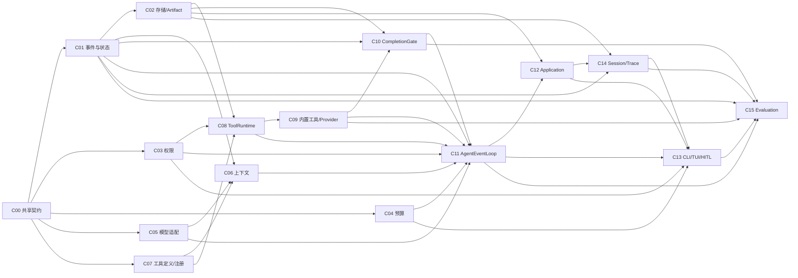

# CodeFlow Agent 组件需求设计索引

本目录把总体蓝图拆成可以由后续 Agent 独立领取、实现和验收的组件任务。每份文档都定义目标边界、前后依赖、公开契约、错误与恢复、安全约束、事件要求、测试门和完成条件。

> 当前基线：文档基于覆盖度修正分支中的结构化 `AgentEvent`、`ToolRuntime`、operation hash 和 `CompletionGate` 契约。存在文件或接口不代表组件已经接通。

## 阅读与领取规则

后续 Agent 在实现任何组件前必须按顺序阅读：

1. 仓库根目录 `AGENTS.md`。
2. 本索引中的系统依赖图、共享完成标准和目标组件行。
3. 目标组件文档。
4. 目标组件的所有“硬依赖”文档。
5. `docs/decisions/` 中被引用的 ADR。

禁止只根据目录名或当前占位接口猜测需求。若实现需要改变上游契约，必须先修改上游文档和测试，再修改下游。

### 接口与状态标注规则

- 标记为“已实现”的组件，其公开接口必须与当前可编译代码一致。
- 尚未完成的组件同时保留“当前基线接口”和“目标接口（规划中）”；后者是验收目标，不表示代码已经存在。
- 需求条目和验收标准默认描述目标形态；只有列出测试证据并通过统一完成门，才能把状态改为“已实现”。
- 后续 Agent 不得引用目标接口直接接线，必须先完成目标组件的依赖门并把对应契约落到代码和测试。

## 组件目录

| ID | 组件文档 | 目标阶段 | 当前基线 | 硬依赖 | 主要下游 |
| --- | --- | --- | --- | --- | --- |
| C00 | [共享契约](00-shared-contracts.md) | D1–D2 | 已实现 | 无 | 全部组件 |
| C01 | [事件事实层与 StateReducer](01-event-state.md) | D1–D3 | 已实现 | C00 | Storage、Loop、CLI、Trace、Eval |
| C02 | [存储与 ArtifactStore](02-storage-artifacts.md) | D7 | 内存接口；SQLite/File 实现缺失 | C00、C01 | Runtime、Session、Loop、Trace |
| C03 | [PermissionEngine](03-permission-engine.md) | D1–D6 | 基础实现 | C00 | Runtime、Loop、CLI、发布工具 |
| C04 | [BudgetController](04-budget-controller.md) | D3–D5 | 基础实现 | C00 | Loop、CLI、Eval |
| C05 | [ModelAdapter](05-model-adapter.md) | D2 | 最小非流式实现 | C00、C01 | Context、Loop、成本账本 |
| C06 | [ContextAssembler](06-context-assembler.md) | D3 | 排序骨架 | C00、C01、C05、C07 | Model、Loop |
| C07 | [ToolDefinition 与 ToolRegistry](07-tool-registry.md) | D1–D3 | 基础实现 | C00 | Runtime、Context、Loop |
| C08 | [ToolRuntime](08-tool-runtime.md) | D3–D4 | 基础流水线；版本/输出 schema 等缺失 | C00、C02、C03、C07 | 内置工具、Loop、Trace |
| C09 | [18 个内置工具与外部 Provider](09-built-in-tools.md) | D3–D6 | 仅 `finish_task` 工厂 | C00、C02、C03、C07、C08 | Loop、Completion、CLI |
| C10 | [CompletionGate](10-completion-gate.md) | D4 | 基础 Gate；完整 evidence/reason 契约缺失 | C00、C01、C02、C09 | Loop、CLI、Eval |
| C11 | [AgentEventLoop](11-agent-event-loop.md) | D3–D4 | 仅创建 Session | C01–C10 | Application、CLI、Eval |
| C12 | [Application Service](12-application-service.md) | D3–D7 | 基础依赖组装 | C02–C11 | CLI、Session 命令、Eval |
| C13 | [CLI/TUI 与 HITL](13-cli-tui.md) | D5 | 命令骨架 | C01、C03、C04、C11、C12、C14 | 用户、Eval |
| C14 | [Session、Trace 与生命周期治理](14-session-trace.md) | D7 | 接口/脱敏骨架 | C01、C02、C03、C12 | CLI、Eval、恢复 |
| C15 | [Evaluation Harness](15-evaluation.md) | D8–D10 | 类型和总门槛 | C01–C14 | 发布决策 |

## 总体依赖图

## 关键路径与可并行工作

### 必须串行的关键路径

1. C00 共享契约稳定。
2. C01 事件/状态与 C07 工具定义稳定。
3. C03 权限 + C08 Runtime 形成安全执行边界。
4. C05 模型 tool calling + C06 上下文形成模型请求边界。
5. C09 至少六个只读工具可用。
6. C11 接通最小模型—工具—观察循环。
7. C10 完成门接入 `finish_task`。
8. C13 实时视图与审批接入。
9. C14 持久化恢复接入。
10. C15 用六任务评估决定是否发布。

### 可并行但必须在接口处会合

- C03 PermissionEngine 与 C04 BudgetController 可并行，均在 C11 会合。
- C05 ModelAdapter 与 C08 ToolRuntime 可并行，均在 C11 会合。
- C02 SQLite 实现可与 D2–D4 并行开发，但 C14 恢复前必须完成。
- C13 Ink 纯视图可在事件投影稳定后并行，审批和取消交互必须等待 C03/C11。
- C15 fixture 可在真实工具目录稳定后并行准备，端到端 runner 必须等待 C11–C14。

## 统一完成标准

任何组件只有同时满足以下条件才可标记完成：

- 公开接口与本文档一致，未把供应商 SDK 类型泄漏到核心层。
- 正常、失败、取消、超时和恢复路径都有确定语义。
- 会产生状态变化的路径发出结构化 `AgentEvent`，或明确由上层负责发出。
- 安全边界、权限和秘密处理有负向测试。
- 确定性单元测试通过；涉及跨组件的组件有契约测试。
- `pnpm check` 和 `codeflow --help` 通过。
- 文档中的验收项有真实证据；未运行的验证必须明确标记。
- 没有把 D2–D8 延后能力用空实现标记为完成。

## 变更控制

- 修改 C00、C01、C03、C07 的公共契约属于高影响变更，必须检查所有下游文档和测试。
- 新增工具必须同时更新 C09 工具清单、权限级别、side-effect/retry 策略和 Context 工具 schema。
- 新增事件必须更新 C01 状态投影、C02 持久化、C13 UI 表示和 C15 trace 完整性检查。
- 新增外部写操作必须定义 prepare/commit、批准绑定、幂等键、状态查询和 `UNKNOWN` 对账。

新组件文档应从 [组件文档模板](component-design-template.md)复制结构。
